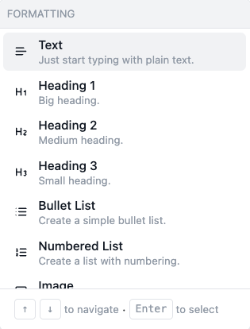

# Creating Emails

Daisychain's email editor is designed to make it easy and quick to draft an email in just a few steps:

1. Select your layout.
2. Choose your sender.&#x20;
3. Write a subject line.&#x20;
4. Write your body.&#x20;

To write the body of your email, just start writing in the blank text-box. &#x20;

If you want to add various components to your email (like buttons, images, and headings) just hit the slash key ( / ) to pull up this "formatting" menu, which looks like this:

<figure><figcaption></figcaption></figure>

