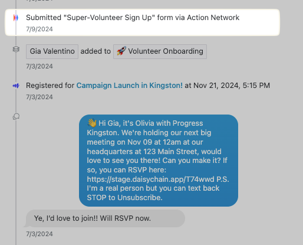
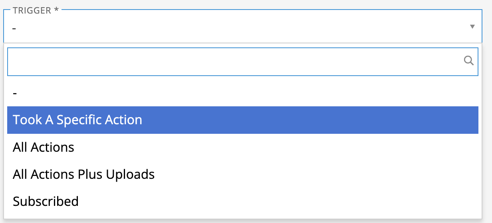
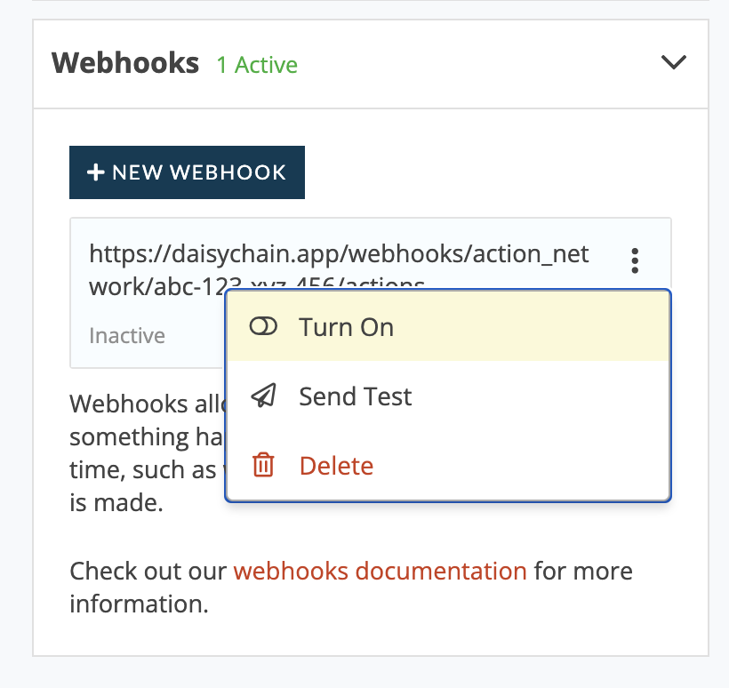

# Action Network


This integration is only available to organizations with a [paid plan](https://actionnetwork.org/get-started/) on Action Network.


### **Overview**

With the Action Network <> Daisychain integration, when someone takes action on Action Network forms, petitions, events, and donations, that person can be added to Daisychain and their action will be viewable in that person's timeline in Daisychain:

<figure><figcaption></figcaption></figure>

In Daisychain, you can use these actions as triggers for [Automations](../organizing/automations/).&#x20;

### **Setup**

1. **Get your Action Network API Key.** In your Action Network account, navigate to the "Details" menu, then select "API & Sync." Then, hit the "Generate API Key" button, and copy the resulting key to your clipboard -- it should be a long string of letters and numbers.\
   ​
2. **Add your Action Network API key to Daisychain.** In your Daisychain account, navigate to Settings > Integrations > Action Network (Add). Paste the API key you copied into the box, and hit "Save."\
   ​
3. **Copy the Web Hook URL.** After you hit save, you'll have access to a Web Hook URL. Copy that URL to your clipboard. You can always find this Web Hook URL at Settings > Integrations > Action Network (Manage).​\
   ​
4.  **Add your Web Hook to Action Network.** Head back to the "API & Sync" page in your Action Network account. From there, scroll down to the "Webhooks" section, and hit the "+ New Webhook" button. Paste in the webhook from your clipboard. Then, you'll want to select the "trigger" that imports people from Action Network into Daisychain:\
    ​

    <figure><figcaption></figcaption></figure>

    You can [read more about these options in the Action Network documentation.](https://actionnetwork.org/docs/webhooks)[​](https://actionnetwork.org/docs/webhooks)

5. **Turn on the Webhook you just set up.** After this step, your Action Network integration will be live!

<figure><figcaption></figcaption></figure>

After your initial setup, people and data will be ingested from the Action Network to Daisychain based on the trigger you selected it. You can also [setup automations](../organizing/automations/) in Daisychain that are triggered when people sign up, donate, or RSVP in Action Network.


If you unsubscribe someone from receiving SMS messages in a Daisychain account that has an active Action Network integration, that status should be updated on the person's profile in Action Network as well.


