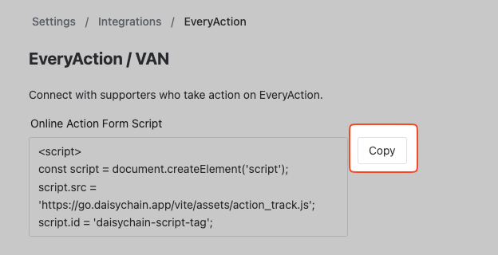

# EveryAction

When you integrate Daisychain with your EveryAction account, you can automatically import people into Daisychain when people submit EveryAction forms.


**A note on names**\
This integration works with online action forms across the Bonterra family of products — EveryAction, NGPVAN, NGP, VAN, and VoteBuilder. If you can add a custom footer to your form in the form builder, the Daisychain integration will work with it, including forms hosted at `secure.ngpvan.com` or `secure.everyaction.com`. To import saved lists from VAN instead, see [ngpvan.md](ngpvan.md "mention").


This works with Online Actions form types including:

* Signup forms
* Event forms
* Volunteer forms
* Petition forms
* Advocacy forms
* Donation forms

You can also trigger [automations](../organizing/automations/) when any of these things happen, which makes it easy to engage and organize EveryAction supporters, RSVPs, and donors as needed.

## What data is captured

When someone submits a form, Daisychain captures their submission in real time and either matches them to an existing person in your account or creates a new one. The following fields are captured from the form:

* First name and last name
* Email address
* Mobile phone number
* City, state/province, ZIP/postal code, and country
* The form's name, type, and URL — so automations can target submissions from a specific form

Subscription status is handled as follows:

* People who submit a form with an email address are subscribed to email in Daisychain (unless they were already subscribed or opted out).
* People are subscribed to SMS only if they checked the SMS opt-in checkbox on the form.


**Custom form fields are not captured**

Custom questions you add to a form (for example, a yard sign preference or t-shirt size) are not brought into Daisychain — only the standard contact fields listed above. Note that survey question data can flow in the other direction: answers to Daisychain [questions.md](../managing-data/questions.md "mention") can be synced to VAN as Survey Responses — see [Syncing Survey Questions](ngpvan.md#syncing-survey-questions).


To setup the EveryAction integration, visit **Settings > Integrations > EveryAction,** and copy the provided code.

<figure><figcaption></figcaption></figure>

In EveryAction, you can paste that code into your form by following these steps:

1. Navigate to the form you'd like to use.
2. Go to "Step 2 - Build Page" of the Form Builder and scroll to the very bottom.
3. In the "Create Custom Footer" Section, hit the "Source" button in the editor, and paste in the code you copied from Daisychain.
4. Press "Publish Changes", and test your form to confirm submissions are flowing into Daisychain.
