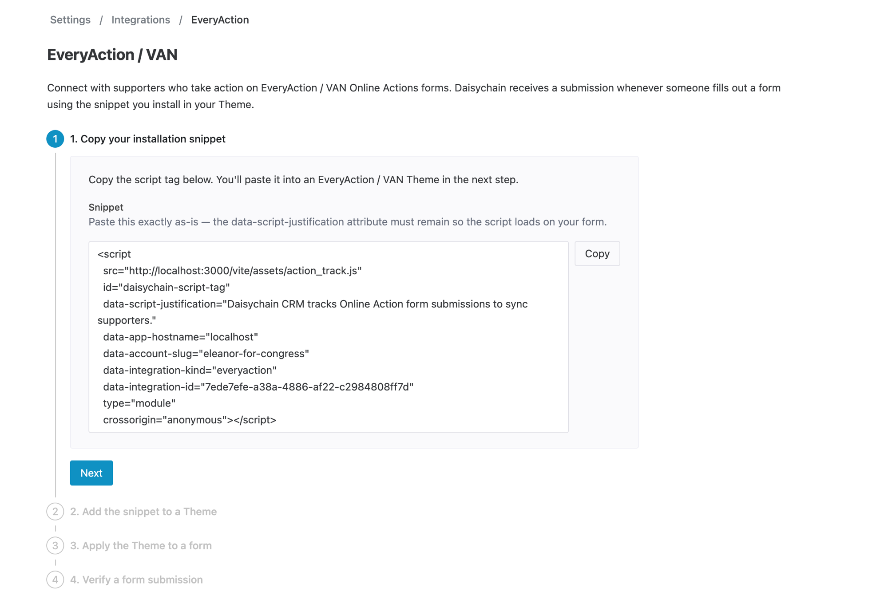

# EveryAction

<figure><figcaption></figcaption></figure>

When you integrate Daisychain with your EveryAction account, you can automatically import people into Daisychain when people submit EveryAction forms.


**A note on names**\
This integration works with online action forms across the Bonterra family of products — EveryAction, NGPVAN, NGP, VAN, and VoteBuilder. If you can add a custom footer to your form in the form builder, the Daisychain integration will work with it, including forms hosted at `secure.ngpvan.com` or `secure.everyaction.com`. To import saved lists from VAN instead, see [ngpvan.md](ngpvan.md "mention").


This works with Online Actions form types including:

* Signup forms
* Event forms
* Volunteer forms
* Petition forms
* Advocacy forms
* Donation forms

You can also trigger [automations](../organizing/automations/) when any of these things happen, which makes it easy to engage and organize EveryAction supporters, RSVPs, and donors as needed.

## What data is captured

When someone submits a form, Daisychain captures their submission in real time and either matches them to an existing person in your account or creates a new one. The following fields are captured from the form:

* First name and last name
* Email address
* Mobile phone number
* City, state/province, ZIP/postal code, and country
* The form's name, type, and URL — so automations can target submissions from a specific form

Subscription status is handled as follows:

* People who submit a form with an email address are subscribed to email in Daisychain (unless they were already subscribed or opted out).
* People are subscribed to SMS only if they checked the SMS opt-in checkbox on the form.


**Custom form fields are not captured**

Custom questions you add to a form (for example, a yard sign preference or t-shirt size) are not brought into Daisychain — only the standard contact fields listed above. Note that survey question data can flow in the other direction: answers to Daisychain [questions.md](../managing-data/questions.md "mention") can be synced to VAN as Survey Responses — see [Syncing Survey Questions](ngpvan.md#syncing-survey-questions).


## Setting up the integration

To set up the EveryAction integration, visit **Settings > Integrations > EveryAction** in Daisychain. The page walks you through a four-step setup:

<figure><figcaption></figcaption></figure>



### Copy your installation snippet

Copy the script tag Daisychain provides. Paste it exactly as-is — the `data-script-justification` attribute must remain so the script loads on your form.



### Add the snippet to a Theme

In EveryAction / VAN, open **Online Actions** and select the **Themes** tab. Open an existing Theme or create a new one, and click into the `<body>` Content area. Paste the snippet at the bottom of the `<body>` Content, immediately after the `{{EmbedForm}}` merge field. Then save and publish the Theme.



### Apply the Theme to a form

Open the form you want Daisychain to ingest in Online Actions and go to the **Basics** page. In the **Form Theme** section, choose the Theme you just saved from the Published Themes dropdown, then save or publish the form.



### Verify a form submission

Submit a test response on a form that uses the Theme. Daisychain will detect it automatically and complete the setup.


