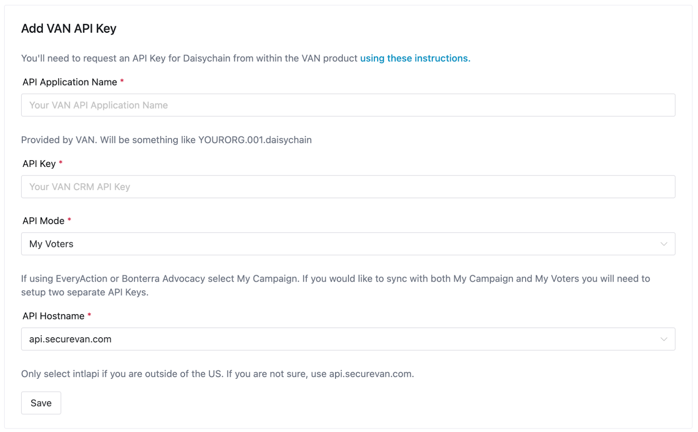
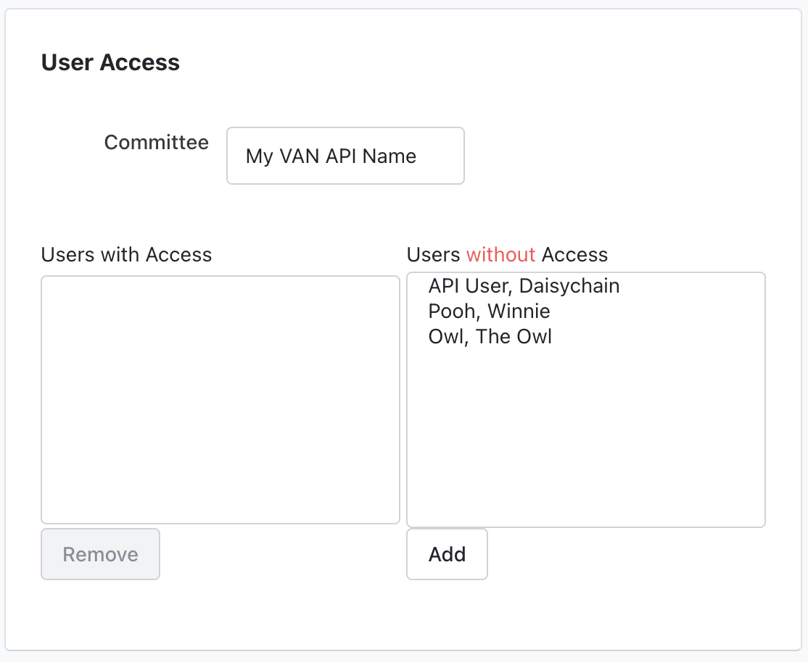
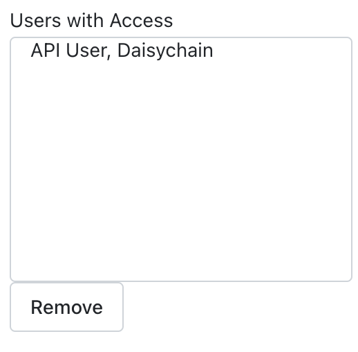
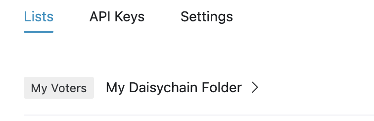
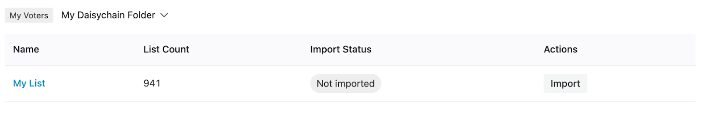
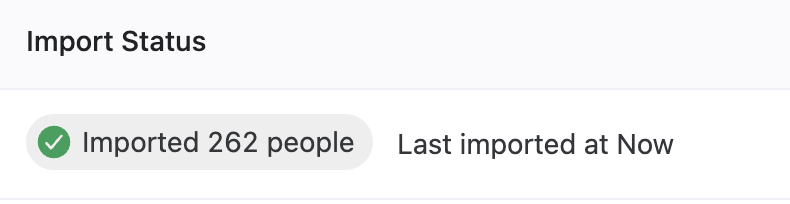
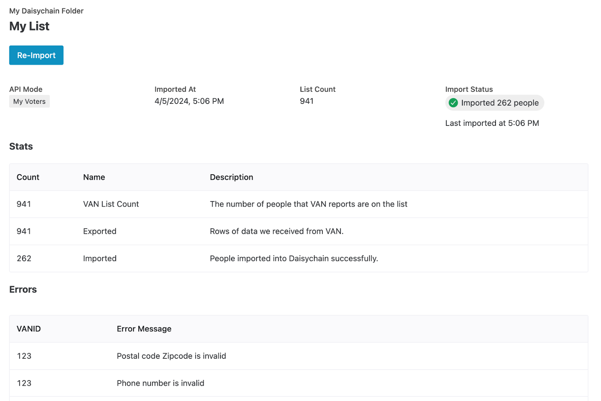
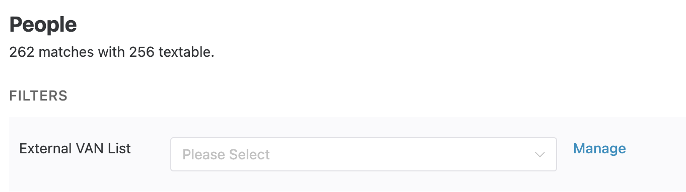
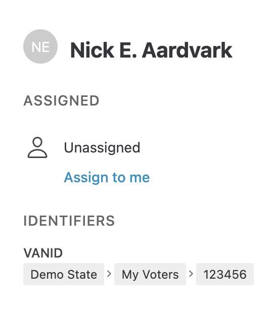

# NGPVAN


**A note on names**\
This document refers to "NGPVAN" and "VAN", but the instructions also apply if you are importing lists from Bonterra products named VoteBuilder, EveryAction, and more. For information about integrating live form submissions from these products, [click here.](everyaction.md)


## How to Set Up Your Integration



### Request an API Key from NGPVAN

To setup this integration, you'll first need to request an API key from VAN by following [their instructions.](https://help.ngpvan.com/van/s/article/2969508-requesting-and-approving-api-keys)



### Add the API Key in Daisychain

Once you have this API key and API application name from VAN, go to your Daisychain account and navigate to Settings → Integrations and click "Add" in the VAN CRM box. You should then see a form you can fill out using the VAN API key and application name provided by your VAN admin. \
\
If you’d like to sync lists of your voters, select “My Voters” under “API Mode,” and if you’d like to sync lists of your campaign (or NGP lists), select “My Campaign”. Once added, click “save”.

<figure><figcaption></figcaption></figure>




### Go to VAN to Share Your Folders

To ensure a list in VAN is available in Daisychain, it needs to be in a Folder shared with Daisychain. After you add your list to your folder and scroll down to “User Access,” you will see something like this:

<figure><figcaption></figcaption></figure>

Select the Daisychain API user, and click “Add”. Verify that the access looks something like below and then click save:

<figure><figcaption></figcaption></figure>


Lists which appear in multiple folders will cause errors in Daisychain; please ensure that each list is only in one unique folder. Additionally, Daisychain can only import saved _Lists,_ and can't import the results of saved _Searches._&#x20;




### Go to Daisychain to Import Your List

All folders you have shared with the Daisychain API will be listed under the “Lists" Tab when you visit **Settings > Integrations > VAN CRM/**\
 

<figure><figcaption></figcaption></figure>

To import a list, click the arrow button to reveal the folder's contents:

<figure><figcaption></figcaption></figure>

Clicking “Import” will move the selected list into Daisychain. And once completed, you will see how many people were successfully imported.

<figure><figcaption></figcaption></figure>

To view errors, click the list name, and you will be taken to the import summary page. Here, you will see a list of import errors, and stats about your imported list.

<figure><figcaption></figcaption></figure>


**Import errors and notes**

* People without a valid phone number will not be imported into Daisychain
* Only the first phone number listed for people will import into Daisychain.



**What fields are imported**

List imports bring in each person's name, email address, one phone number (preferring their verified cell phone, along with that number's SMS opt-in status), and mailing address. VAN custom fields, survey responses, and activist codes are **not** imported into Daisychain — Survey Question and Activist Code mappings sync one-way, from Daisychain back to VAN.




## Syncing Data Back to VAN

You can sync data collected in Daisychain back to VAN. Daisychain currently syncs back data in for Survey Questions, Activist Codes, and Opt-Outs.&#x20;

### Syncing Survey Questions

Map Daisychain [questions.md](../managing-data/questions.md "mention") to VAN Survey Questions to sync answers recorded in Daisychain back to VAN as Survey Responses.

**Setup:**

1. First, create a matching [Question](../managing-data/questions.md) in Daisychain (Settings > People > Questions). For a support question, you'd create a multiple choice or dropdown question with response options like "Strong Support," "Lean Support," "Undecided," etc. — matching whatever response options exist on the VAN side.
2. Go to Settings > Integrations > VAN CRM > Questions.
3. Find the VAN Survey Question you want to map.
4. In the "Mapped Question" column, select the Daisychain Question you created.
5. Expand the Survey Response Mappings and map each VAN Survey Response to the corresponding Daisychain answer option.

### Syncing Activist Codes

Map Daisychain [tags.md](../managing-data/tags.md "mention") to VAN Activist Codes to sync Tags applied in back to VAN as Activist Codes.

**Setup:**

1. Go to Settings > Integrations > VAN CRM > Activist Codes.
2. If your Daisychain account is connected to multiple VAN committees, select the appropriate one from the dropdown.
3. Find the VAN Activist Code you want to map.
4. In the "Mapped Tag" column, select the Daisychain Tag that should trigger this Activist Code.

Once mapped, whenever that Tag is added to an individual person in Daisychain, the Activist Code will sync to their VAN record. And whenever a Tag is _removed_ from someone in Daisychain, the mapped Activist Code will be removed from their VAN record.&#x20;


Activist codes will only be synced to VAN when a Tag is applied to an individual Person. A bulk action to apply a Tag to >1 person will _not_ apply the Activist Code in VAN.&#x20;


### Syncing Opt-outs

[opt-outs.md](../texting/opt-outs.md "mention") created in Daisychain — whether through automated keyword detection (like "STOP") or a manual opt-out — are automatically synced back to VAN. Specifically:

* A "Do Not Text" canvass result is added to their contact history
* Their SMS opt-in status is set to "Opt-Out" on the phone record

This sync happens for contacts with a valid VAN ID.

## Viewing VAN information inside Daisychain

Once you have imported a list to Daisychain, information from VAN will appear on the People page in Daisychain.

<figure><figcaption></figcaption></figure>

You can select a VAN list to filter by, and on an individual person’s page you can see information about that person’s VAN ID:

<figure><figcaption></figcaption></figure>

