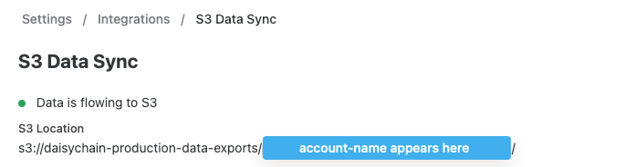
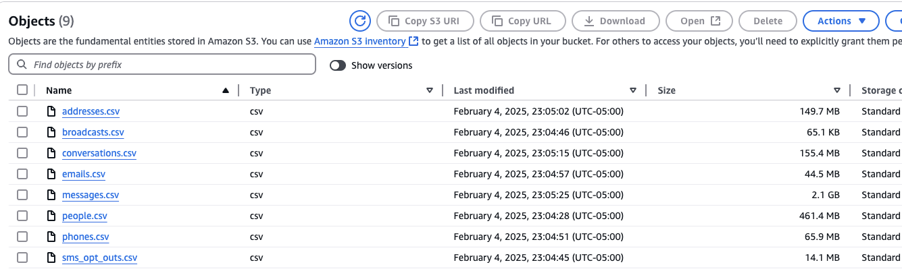

# Data Sync

The ability to sync your Daisychain data to an [Amazon S3 Bucket](https://aws.amazon.com/s3/) is designed to allow customers to load data from Daisychain into data warehouses like AWS Redshift, Google BigQuery or Snowflake where analysts can query it and derive insights about your campaigns.

This is an advanced topic and requires additional data infrastructure engineering that is specific to your organization to get the files we provide on S3 into your data warehouse. There are a wide variety of tools and techniques for loading data into data warehouses, and choosing the best one is up to the customer. We simply provide the building blocks to make a secure data warehouse sync possible

### Setup

1. **Create an Amazon AWS account for your organization if you don't have one already.** We will grant access to either the account as a whole or a specific AWS IAM Role within your account.
2. **In your Daisychain account, set up a Daisychain S3 sync for your AWS Account via Settings > Integrations.** We’ll grant cross-account access to your data by granting permissions to your AWS Account using its identifier.
3. **Optionally, specify a specific IAM Role to further restrict the resources within your AWS Account that can access your Daisychain data via S3.** When this is not specified, access is granted to your entire AWS Account. Using and configuring IAM Role permissions is an advanced feature. Use cases for this enhanced security option include:
   1. Allowing access for specific users using temporary credentials via Assume Role.
   2. Allowing access only from specific resources within your AWS Account: for example, your Redshift Cluster, or a particular EC2 instance.

### Access via AWS Web Interface

To access your integrated data in the AWS web interface, navigate to **Settings > Integrations > S3 Data Sync > AWS Account ID**.

You should see an interface like this, with an account specific URL:

<figure><figcaption></figcaption></figure>

To access your data, visit the following URL, ensuring that you replace your {account-name}:

**https://us-east-1.console.aws.amazon.com/s3/buckets/daisychain-production-data-exports/{account-name}/**

This should enable you to access the AWS interface, which should look like this:

<figure><figcaption></figcaption></figure>

### Data Details

All tables available via Data Sync are documented in our [Data Dictionary](https://go.daisychain.app/api-docs/data-dictionary), which includes column types, relationships, and enum values for every table. You can also download the schema as [JSON](https://go.daisychain.app/api-docs/data-dictionary/json) or [DDL](https://go.daisychain.app/api-docs/data-dictionary/ddl) for use in your data warehouse setup.

Each of these tables is offered in CSV format and is refreshed nightly shortly after midnight UTC.
