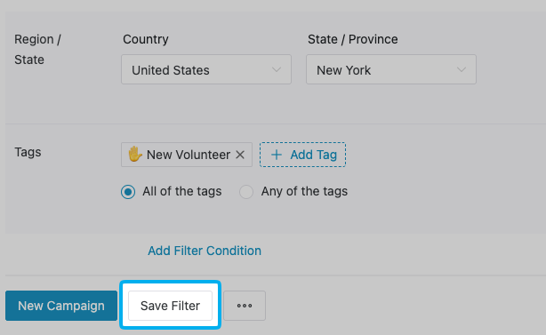
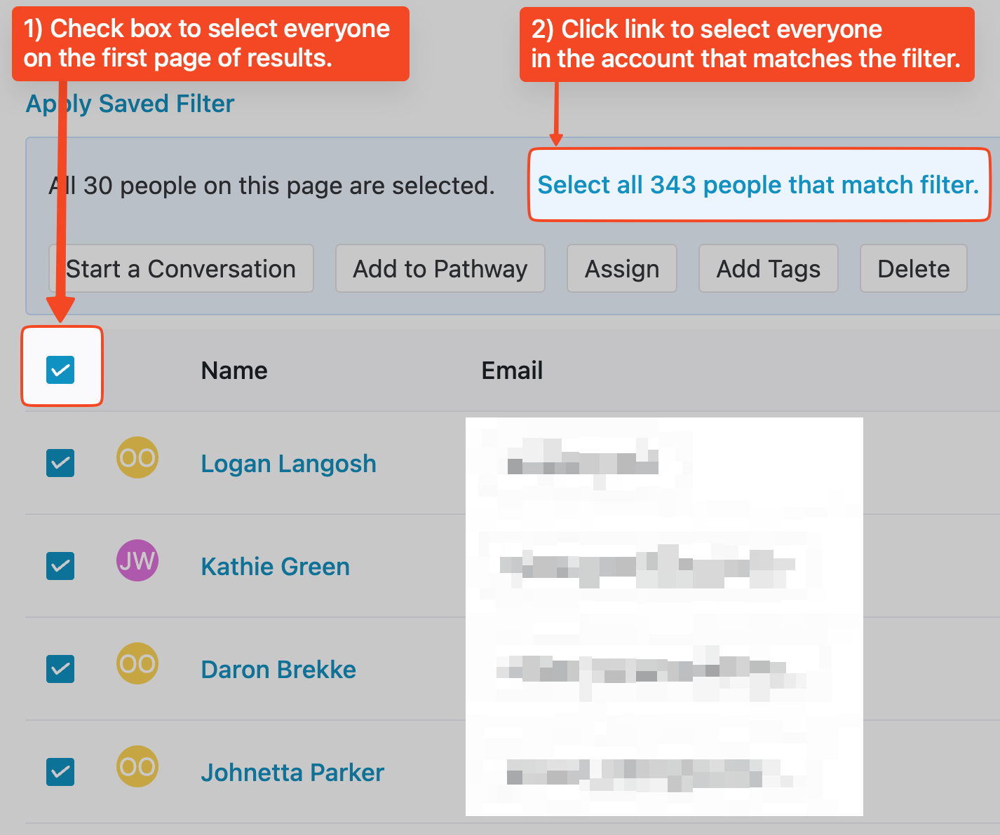

# Filters

### **How to Use Filters**

1. Navigate to the **People** section of your Daisychain account.
2. Press the **Filter** button.
3. Choose the category of filter from the options that appear.

### Available Filter Categories:

* **Saved Filters** – Access any filters you've saved previously for quick reuse.
* **ActBlue** – Filter people based on whether they are ActBlue donors. You can further narrow by the specific page or form they donated through.
* **Activity** – Filter people based on actions they've taken, like donations, form submissions, event attendance, texting engagement, or automation triggers. Choose from dozens of activity types (e.g., _Mobilize event RSVP logged_, _Link Clicked_, _CSV Import Processed_), then narrow results by a preset or custom time range.
* **Assigned** – Filter by staff member or volunteer assigned to a person.
* **Campaigns** – Filter people based on whether they received a message from a campaign and how they interacted with it. Options include message status (Sent, Delivered, Undelivered, Paused) and engagement outcomes (Clicked, Clicked but did not convert, Converted). You can filter across all campaigns or select specific ones.
* **Country** – Filter by a person's country.
* **Custom Fields** – Filter using values in your account’s [custom fields.](custom-fields.md)
* **CSV Import** – Filter by the CSV file someone was added through.
* **External VAN List** – Filter by lists imported from VAN.
* **Location** – Filter by geographic radius from a central point (e.g., zip code or city).
* **Mobilize Events** – Filter people who RSVP’d to any Mobilize event, or to specific events you choose.
* **Pathway** – Filter people based on their progress along a specific pathway. You can target individuals by pathway and stage, or find those not on any pathway at all.
* **Postal Codes** – Filter by specific postal/ZIP codes.
* **Region / State** – Filter by U.S. state or regional designation.
* **Tags** – Filter by [tags](tags.md) applied to people in your database.

### **Saved Filters**

*   After filtering your People list, you you can create a **Saved Filter** by pressing the "Save Filter" button.  

    <figure><figcaption></figcaption></figure>
* Saved Filters can be easily used again in the future. To do so, just click the "Filter" button, then click "Saved Filters" and select the filter you'd like to use.  
* Saved Filters can be used used for targeting [Message Campaigns](../texting/campaigns/).

### **Notes on Using Filters**

* You can apply multiple filters at once. If you do, they will be additive, meaning you will be filtering down to people who match ALL the filters you apply.\
  ​
* You can remove filters by pressing the X button. 
* When filtering people by **Tags**, you can choose to use multiple tags. When you do so, you can select "All of the Tags" (an "AND" condition) or "Any of the Tags" (an "OR" condition.)\
  ​
*   To select everyone in a filtered list (in order to take a bulk action) you can select the checkbox in the top-left corner of the list. When you do, you'll select everyone on that page -- which is generally limited to 30 records. If you'd like to select more people, click the link highlighted in the screenshot below:\
     

    <figure><figcaption></figcaption></figure>
