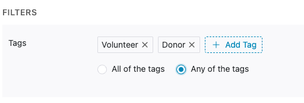

# Tags

## Creating and Deleting Tags

To create a tag, navigate to Settings, and then Tags. Then click the + button to create a tag. You can create as many tags as you'd like.


Tags must be created before they can be used, and they cannot be renamed. When you delete a tag, it will remove that tag from all People who have that tag.


## Using Tags

### Applying Tags

Once your tag has been created, you can apply tags to people in the following ways:

* Individually, in their Person record and in the [Inbox](../texting/inbox.md).
* In bulk, via [CSV import](csv-imports.md) and through bulk actions after [filtering a list. ](filtering-people.md)

### Filtering by Tag

You can [filter the People list](filtering-people.md) by Tag. If you'd like to filter by multiple tags, you can choose whether you want to have the results display People who have _all_ of the tags or who have _any_ of the tags.&#x20;

<figure><figcaption></figcaption></figure>

You can also filter the [Inbox](../texting/inbox.md) by Tag by navigating to any tab of the Inbox and clicking **Filter > Add a Tag Filter.**

### Removing Tags

You can remove tags from a Person by pressing the X on the applied tag.

&#x20;
