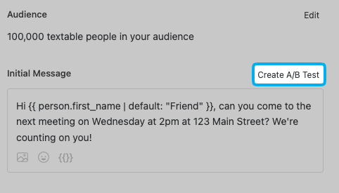

# A/B Testing

A/B testing helps you figure out which message resonates best with your supporters. In Daisychain, you can create multiple message variants, send them to a portion of your audience, see how each variant performed, then send the winning message to the rest.

### Starting an A/B Test

1. **Create a Campaign**: Start as you normally would.&#x20;
2.  **Click "Create A/B Test"** button on the top-right of the Initial Message bo&#x78;**:**\

    <figure><figcaption></figcaption></figure>

This will then be able to access tabs in your Initial Message box where you can create different variants. By default, these tabs will be labeled "A", "B", "C", etc.  You can create up to five variants.&#x20;

<figure><figcaption></figcaption></figure>

3.  **Click the A/B test settings** button to launch a pop-up window where you can:

    1. Name each variant
    2. Use the **Experiment Audience Percentage slider** to choose what portion of your audience will receive the test messages. For example, if you set the slider to 50%, and you have 100,000 people, then about 25,000 people will receive each of Variant A and Variant B, and the remaining 50,000 people will be held back.

    <figure><figcaption></figcaption></figure>

* Edit the names of your variants. Daisychain automatically splits the experimental group evenly across your variants.\
  \

4. **Review Message Variants:**  on Step 3 of the Campaign Wizard you'll have a chance to ensure message previews, personalization, and counts all look right. \

5. **View the Report:** After sending, you'll land on the [campaign-report.md](campaign-report.md "mention"), where you'll see:\

* A funnel chart showing performance by variant.\

* A results table with side-by-side stats for each variant:
  * Delivered
  * Clicks (if there’s a link)
  * Conversions (if you used integrations like ActBlue, Mobilize, etc.)
  * Replies
  * Opt-outs

Daisychain also provides a statistical analysis indicator, which activates once each variant has at least 30 recipients.\

5. **Pick a Winner:** When you’re ready, click Mark Winner next to your chosen variant. The winning message will then be sent to the remaining audience (the percentage you held back).


#### Tips for Success

* **Test one element at a time:** tone, call to action, framing, use of images, etc.
* **Give the test enough time** to gather responses before selecting a winner.
* **Apply learnings beyond the test:** use insights to improve all future outreach.

