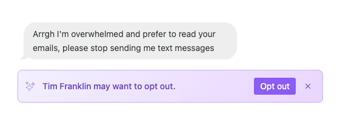

# Opt-Outs


**Need to import or export a list of of opt-outs?** You can do so by visiting Setttings > Channels > Opt-outs.&#x20;


### **Automatic Opt-Outs**

If someone sends a message using opt-out keywords (see below), that person will be automatically marked as opted out. This means that you will no longer be able to send that person another message through Daisychain unless they are opted back in.&#x20;

#### **Standard Opt-Out Keywords**

* CANCEL
* END
* QUIT
* STOP
* STOPALL
* UNSUBSCRIBE

#### **Non-Standard Opt-Out Keywords**

In addition to the standard keywords listed above, Daisychain will also opt out people who reply using variations and misspellings of these keywords, as well as a variety of hostile responses that clearly indicate that someone doesn't want to be messaged.

While Daisychain automatically process opt-outs for a variety of keywords (like "stop" and "unsubscribe"), it only does so when that word is the only word in a message in order to prevent "false-positives" — we don't want to accidentally opt someone out who wants to receive your messages.

### Automatic Opt-Out Request Detection

In addition to keyword matching, Daisychain’s Opt-Out Request Detection automatically identifies and flags natural-language opt-out requests, even if they don’t use standard keywords and aren't an exact match for our non-standard opt-out keywords (see above). Examples:

* "Please stop texting me."
* "I don’t want these messages anymore."

When detected, Daisychain displays an **Opt Out** suggestion in the Inbox.&#x20;

<figure><figcaption></figcaption></figure>

* Saves organizers time by making it quick and easy to view opt-out requests.&#x20;
* Keeps contact lists cleaner.
* Improves long-term deliverability.

### **Auto-Processing Detected Requests**

By default, Daisychain flags natural-language opt-out requests and shows them in the Inbox as suggestions. You also have the option to automatically process these detected requests: when enabled, contacts who send a natural-language opt-out (like “Please stop texting me”) will be opted out immediately, without requiring manual confirmation.

This saves time and ensures your lists stay clean automatically. This option is toggled off by default, but you you can toggle this option on in **Settings → Texting → Opt-Outs.**&#x20;

### Manual Opt-Outs

You can also opt-out a person manually by clicking the "opt-out" button, which appears below their name in the [Inbox](inbox.md) and in their Profile.&#x20;

### Bulk Opt-Outs via CSV

If you need to opt out a large number of phone numbers at once, you can upload a CSV of phone numbers at **Settings > Channels > Texting > Opt-Outs**.

The CSV should contain only one column with a phone number on each line. A header row is optional.

This is useful for:

* Syncing opt-outs from another platform or texting tool
* Restoring opt-outs that were accidentally overridden (for example, by a CSV import that mapped a column to SMS Opt-In — see [CSV Imports](https://daisychain.gitbook.io/help/managing-data/csv-imports) for details)
* Honoring opt-out requests received outside of Daisychain (such as via email or a web form)

### Opting People Back In

#### **How to opt individual people in**

In the Inbox or a person's profile, hit the  `Opt In` button next to their phone number.

#### **How to opt people in via CSV**

1. **Prepare Your CSV**
   * Required columns:
     * `phone` (or `phone_number`)
     * `sms_opt_in` (set to `true` or `1` or `yes`)
   * Optional: `first_name`, `last_name`, etc.
2. **Upload the CSV:** Go to **People → Import → CSV Upload**.
3. **Verify:** Spot-check a person’s profile to confirm it worked.&#x20;
