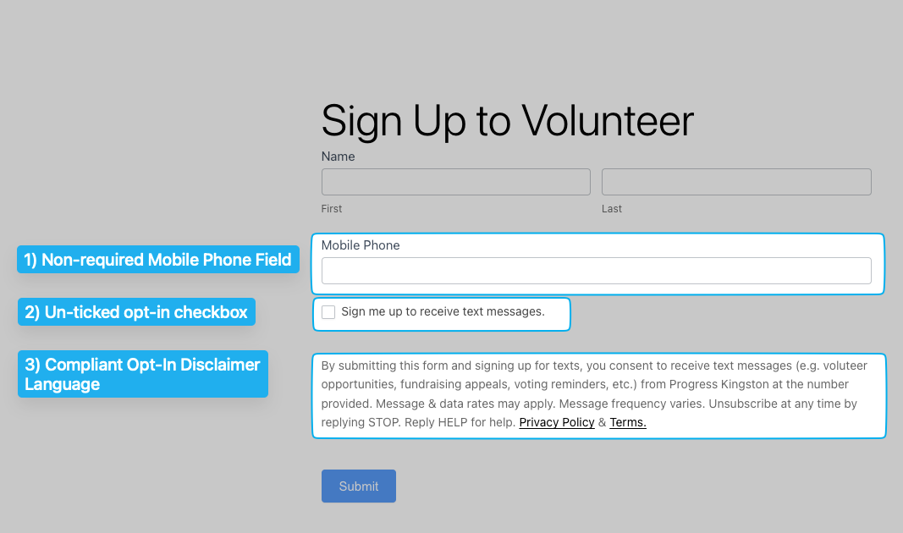

# Phone Number Registration

### **Overview**

When you create a new Daisychain account, it will come with a dedicated phone number that will be used for text messaging. This number needs to be officially registered to ensure your text messages are properly authenticated and delivered. At Daisychain, we handle most steps of phone number registration on behalf of our customers, including working working with third party organizations like The Campaign Registry (TCR).&#x20;

### Comparing Phone Number Types

In Daisychain, there are three different types of phone number you can use, and you can select whichever type is best for your organization's needs.

* **10DLC** (which stands for "10 digit long code") numbers, which are "normal" phone number that use a local area code.
* **Toll Free** phone numbers  that usually start with 833 or 844.&#x20;
* **Short-Code**, for five-digit phone numbers, like 54321.

When selecting a phone number for messaging, it’s important to consider your use case, audience size, and compliance requirements. Below is a breakdown of the available number types and their key characteristics.

<table data-header-hidden><thead><tr><th width="144.7421875"></th><th width="170.640625"></th><th width="185.1640625"></th><th width="242.37109375"></th></tr></thead><tbody><tr><td><strong>Number Type</strong></td><td><strong>Best For</strong></td><td><strong>Pros</strong></td><td><strong>Cons</strong></td></tr><tr><td><strong>Toll-Free</strong></td><td>Low-to-medium medium volume messaging</td><td>Solid deliverability, faster approvals, easier registration</td><td>Slower throughput at the highest volumes as compared to short code.</td></tr><tr><td><strong>Local 10DLC</strong></td><td>Local outreach</td><td>Great deliverability and fast throughput if you have a high "trust score."</td><td>Registration can be slow and often requires website and privacy policy changes. Nonprofits with low "trust scores" may also face daily message caps, especially to T-Mobile numbers.</td></tr><tr><td><strong>Short Code</strong></td><td>High-volume campaigns, urgent alerts</td><td>Fastest throughput, highest deliverability</td><td>Short-code leasing fee, long registration process. Only makes sense with a large list of opted-in supporters.</td></tr></tbody></table>

### **Registration Timelines**

* **10DLC** registrations typically take an average of five business days to be approved, assuming all items in the checklist below have been accurately completed before registration.
* **Toll-free registrations** typically take an average of four business days to be approved, assuming all items in the checklist below have been accurately completed before registration.
* **Short code registrations** typically take six weeks to be approved, and often require more robust documentation.&#x20;

### **Registration Requirements**

In order to register your organization or campaign to send text messages, you'll want to make sure to have the following:

* [ ] **Legal Name:** As it appears on IRS or government forms.
* [ ] **Primary Contact Info:** Name, email, and phone number of the primary contact for the organization.&#x20;
* [ ] **Website:** The public web URL for your organization or campaign.&#x20;
* [ ] **EIN Number:** EIN as per your IRS records. You can [apply for an EIN here.](https://sa.www4.irs.gov/modiein/individual/index.jsp)&#x20;
* [ ] **Sign Up Form Link** Your website must contain a [compliant sign up form.](./#sign-up-form-requirements)
* [ ] **Privacy Policy Link:** Your website must include a link to a [compliant privacy policy.](./#privacy-policy-info)
* [ ] **Mobile Terms of Use:** Your website must contain compliant [Mobile Terms of Use](./#terms-of-use-info), either as a dedicated page or a section of your privacy policy.&#x20;
* [ ] **Campaign Verify Token:** If your organization is a 527 (a political campaign, party committee, or PAC) registered with the FEC or a state, local, or tribal election authority, a [Campaign Verify](about-campaign-verify.md) token is required — The Campaign Registry and the carriers are moving toward requiring it for every eligible organization, and we can't complete your registration without one. Campaign Verify is only available to those 527s; 501(c)(3) and 501(c)(4) organizations can't get a token, even when sending political messages.&#x20;

### **Sign-Up Form Requirements**

When registering your phone number, you may be asked to submit a URL of a website that contains a sign-up form where people can opt-in to receive mobile messages. To ensure your registration is approved, please make sure your form includes the following three elements:

1. a non-required field for collecting mobile phone numbers
2. an _unticked_ checkbox to opt-in to receive text message
3. disclaimer language modeled after the language below\
   ​\
   &#xNAN;_&#x42;y submitting this form and signing up for text messages, you consent to receive informational and engagement messages from \[Organization Name] at the number provided, which may include updates, event reminders, and opportunities to take action. Message and data rates may apply. Message frequency varies. Unsubscribe at any time by replying STOP. Reply HELP for help. Privacy Policy \[link] & Terms \[link]._

Here's an example:&#x20;

<figure><figcaption></figcaption></figure>

### **Privacy Policy Info**&#x20;

When registering a phone number, a compliant privacy policy must be easily found on your organization's website, with **a clear link to this privacy policy in your website's footer.** An example complete privacy policy can be found [here.](https://fastform.org/progress-kingston-privacy-policy/)&#x20;

Ensure your policy explicitly states non-sharing of personal data with third parties without consent, except under legal obligations, and provides clear opt-out instructions for communications, especially text messages. It's crucial to avoid language that implies sharing private data for marketing purposes.&#x20;

Carefully review sections on information sharing to eliminate any inconsistencies or mentions of data sharing that could lead to use case rejection.

A sample statement for your policy could be:


### **Information Sharing and SMS Communication**

\[Your organization/campaign] upholds stringent privacy standards, guaranteeing that the personal information of our users and members remains confidential.  **Mobile information will not be shared with third parties/affiliates for marketing or promotional purposes.** All the above categories exclude text messaging originator opt-in data and consent; this information will not be shared with any third parties.

However, we may share information (1) with vendors, consultants, and other service providers who need access to carry out work on our behalf (and who will not use such information for their own purposes), and (2) if we believe disclosure is required by any applicable law, rule, or regulation or to comply with law enforcement or legal process.

To opt out of SMS messages at any time, simply reply STOP to any of our text messages. You can also opt back in by texting START to the same number.


### **Terms of Use Info**

When registering a phone number, you must have compliant Mobile Terms of Use — either as a dedicated page on your website linked in your website's footer, or as a dedicated section of your Privacy Policy. Your Mobile Terms of Use must contain a section that mirrors the text on the opt-in disclaimer. Here's an example:


**Mobile Terms of Use**

By signing up for text message alerts, you consent to receive informational and engagement messages from \[Organization Name] at the number provided, which may include updates, event reminders, and opportunities to take action. Message and data rates may apply. Message frequency varies. Unsubscribe at any time by replying STOP. Reply HELP for help.&#x20;


## 10DLC Limits

Carriers place limits on how many texts can be sent through a 10DLC number. These limits vary by carrier, by your type of organization, and by a "trust score." Daisychain automatically handles limits  so you don’t have to worry about them.


**Note for Political Campaigns**

If your organization is a candidate committee, party committee, PAC, or ballot initiative committee at any level — federal, state, or local — you are likely a 527 political organization and are required to register with Campaign Verify. This unlocks significantly higher throughput (uncapped on T-Mobile vs. 2,000 messages/day with standard use cases). See the [help doc for Campaign Verify](about-campaign-verify.md) for details.



**Note for 501(c)(3) and 501(c)(4) organizations**

Campaign Verify is not available to you, even if you send explicitly political messages — it verifies only 527 organizations registered with the FEC or a state, local, or tribal election authority. Your throughput is set by your Trust Score instead. If you're hitting limits, see [Options if You're Hitting Message Limits](#options-if-youre-hitting-message-limits) below.


### How Daisychain Handles Limits

Unlike many platforms, Daisychain actively manages these restrictions for you:

* **Automatic queuing**: If you hit T-Mobile’s daily cap, Daisychain automatically holds the extra messages and delivers them the next day when your limit resets.
* **Rate-aware sending**: Campaigns automatically respect the AT\&T per-minute throttle, so your messages are paced without you needing to adjust anything.

### Carrier Limits

* **AT\&T** controls speed: how many SMS segments or MMS messages can go out each minute.
* **T-Mobile** controls daily volume: how many total SMS/MMS segments can be delivered in a 24-hour window which resets at midnight Pacific time.&#x20;

### Typical Caps

| Organization Type            | AT\&T (per minute) | T-Mobile (per day) |
| ---------------------------- | ------------------ | ------------------ |
| Political Organization (527) | Up to 4,500        | Unlimited          |
| Nonprofit (501c3/4)          | Up to 4,500        | 2,000 – 200,000    |

#### Trust Scores

Your organization's trust score is based on a reputation algorithm that evaluates specific criteria — including factors like  registration data accuracy (such as whether your address matches your EIN), organization age and size, and overall legitimacy as determined through secondary vetting.

<table><thead><tr><th width="183.921875">Trust Score</th><th>T-Mobile message limit (SMS segments + MMS Messages)</th></tr></thead><tbody><tr><td>75-100</td><td>200,000/day</td></tr><tr><td>50-74</td><td>40,000/day</td></tr><tr><td>25-49</td><td>10,000/day</td></tr><tr><td>1-24</td><td>2,000/day</td></tr></tbody></table>

### Options if You’re Hitting Message Limits

* **Toll-Free Numbers**: No T-Mobile daily cap. Great option if you need to guarantee very high volumes and can't get a high Trust Score or qualify for a Political use case on 10DLC.&#x20;
* **10DLC Appeal**: T-Mobile’s daily message caps (e.g. 2,000 up to 200,000 messages) depend in part on your organization’s Trust Score. If your score is in the lower tier, Daisychain can submit a request for re-evaluation (often via secondary vetting) to improve that score. That process may require submission of official documentation and verification of your organization’s legitimacy. If you're interested in this, send an email to help@daisychain.app
